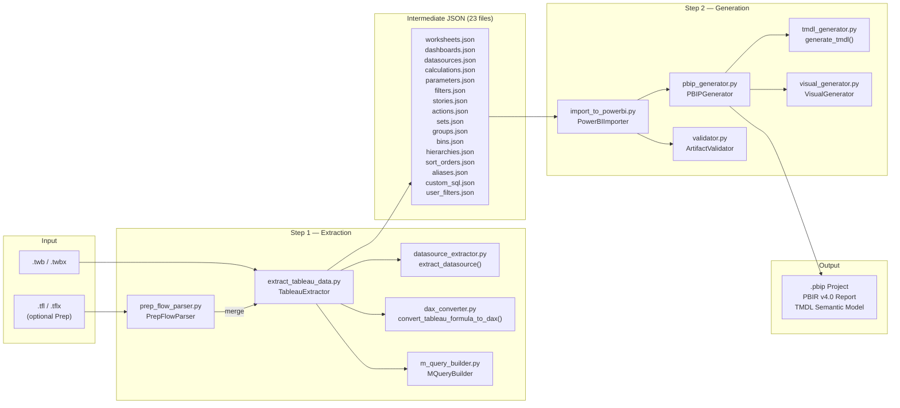

# Architecture — Tableau to Power BI Migration Tool

## Pipeline Overview

The migration follows a **2-step pipeline**: Extraction → Generation.

<p align="center">
  
</p>



### ASCII Pipeline Diagram

For environments without Mermaid rendering:

```
              +-------------------------------+
              |           INPUT               |
              |  .twb / .twbx  (workbook)     |
              |  .tfl / .tflx  (Prep, opt.)   |
              +---------------+---------------+
                              |
                              v
              +-------------------------------+
              |    STEP 1 - EXTRACTION        |
              |   tableau_export/             |
              |                               |
              |  extract_tableau_data.py       |
              |    +-- datasource_extractor.py |
              |    +-- dax_converter.py        |
              |        172+ DAX conversions    |
              |    +-- m_query_builder.py      |
              |        49 connectors           |
              |        43 transforms           |
              |    +-- prep_flow_parser.py     |
              +---------------+---------------+
                              |
                              v
              +-------------------------------+
              |      23 INTERMEDIATE JSON     |
              |                               |
              |  worksheets    calculations   |
              |  dashboards    parameters     |
              |  datasources   filters        |
              |  stories       actions        |
              |  sets/groups   bins            |
              |  hierarchies   sort_orders    |
              |  aliases       custom_sql     |
              |  user_filters  hyper_files    |
              +---------------+---------------+
                              |
                              v
              +-------------------------------+
              |    STEP 2 - GENERATION        |
              |   powerbi_import/             |
              |                               |
              |  import_to_powerbi.py         |
              |    +-- pbip_generator.py       |
              |        .pbip + PBIR report    |
              |    +-- tmdl_generator.py       |
              |        tables, columns,       |
              |        measures, RLS roles    |
              |    +-- visual_generator.py     |
              |        190 visual types        |
              |    +-- validator.py            |
              |        JSON + TMDL + DAX      |
              +---------------+---------------+
                              |
                              v
              +-------------------------------+
              |           OUTPUT              |
              |                               |
              |  .pbip Project                |
              |  PBIR v4.0 Report             |
              |  TMDL Semantic Model          |
              +-------------------------------+
```

## Module Responsibilities

### `tableau_export/` — Extraction Layer

| Module | Responsibility |
|--------|---------------|
| `extract_tableau_data.py` | Main orchestrator — parses TWB/TWBX XML, extracts 23 object types |
| `datasource_extractor.py` | Datasource extraction (connections, tables, columns, calculations, relationships) |
| `dax_converter.py` | 133+ Tableau → DAX formula conversions (LOD, table calcs, security, etc.) |
| `m_query_builder.py` | Power Query M generator (49 connector types + 43 transformation generators) |
| `prep_flow_parser.py` | Tableau Prep flow parser (.tfl/.tflx → Power Query M) |
| `prep_flow_analyzer.py` | Prep flow profiler — FlowProfile (inputs, outputs, transforms, M queries, assessment), 18 operation types |
| `server_client.py` | Tableau Server/Cloud REST API client (PAT/password auth, download, batch) |

### `powerbi_import/` — Generation Layer

| Module | Responsibility |
|--------|---------------|
| `import_to_powerbi.py` | Generation pipeline orchestrator |
| `pbip_generator.py` | .pbip project generator (PBIR v4.0 report, visuals, filters, bookmarks, slicers) |
| `tmdl_generator.py` | Unified semantic model generator (TMDL: tables, columns, measures, relationships) |
| `visual_generator.py` | Visual container generator (190 visual types, data roles, config templates) |
| `m_query_generator.py` | Sample data M query generator |
| `validator.py` | Artifact validator (JSON, TMDL, DAX semantic validation) |
| `qa_suite.py` | Post-migration QA report card (sentinels, empty visuals, format coverage, zones, orphan filters, fidelity) |
| `scripts/autoplay.py` | Batch autoplay runner for post-migration validation and artifact QA summaries |
| `migration_report.py` | Per-item fidelity tracking and migration status reporting |
| `shared_model.py` | Multi-workbook merge engine: fingerprint-based table matching, column overlap scoring, measure/column/parameter conflict resolution |
| `merge_assessment.py` | Merge assessment reporter: JSON + console output, scoring (0–100), merge/partial/separate recommendation |
| `thin_report_generator.py` | Thin report generator: PBIR `byPath` wiring, field remapping for namespaced measures |
| `api_server.py` | REST API server: stdlib `http.server`, POST /migrate, GET /status, GET /download, GET /health, GET /jobs |
| `schema_drift.py` | Schema drift detection: compare extraction snapshots, detect added/removed/changed objects |
| `prep_lineage.py` | Cross-flow lineage graph engine: build PrepLineageGraph from FlowProfile objects, match outputs→inputs |
| `prep_lineage_report.py` | Lineage HTML report & merge advisor: 7-section interactive HTML, Mermaid diagram, merge recommendations |
| `assessment.py` | Pre-migration readiness assessment: 9 categories (datasource, calculation, visual, filter, data model, interactivity, extract, scope, connection audit), pass/warn/fail scoring |
| `server_assessment.py` | Server-level portfolio assessment: per-workbook GREEN/YELLOW/RED grading, 8-axis complexity, effort estimation, migration wave planning, HTML dashboard |
| `global_assessment.py` | Cross-workbook global assessment: pairwise merge scoring, BFS clustering, HTML heatmap report |

### `powerbi_import/deploy/` — Fabric Deployment

| Module | Responsibility |
|--------|---------------|
| `auth.py` | Azure AD authentication (Service Principal + Managed Identity) |
| `client.py` | Fabric REST API client with retry logic |
| `deployer.py` | Fabric deployment orchestrator |
| `utils.py` | DeploymentReport, ArtifactCache |
| `config/settings.py` | Centralized config via env vars |
| `config/environments.py` | Per-environment configs (dev/staging/production) |

## Data Flow Detail

### Step 1: Extraction

```
Tableau XML → ET.parse → 23 extract_*() methods → 23 JSON files
                                    ↓
                        datasource_extractor.py
                          (connections, tables, columns, joins)
                                    ↓
                           dax_converter.py
                          (Tableau formula → DAX)
                                    ↓
                          m_query_builder.py
                         (connection → Power Query M)
```

### Step 2: Generation

```
23 JSON files → PowerBIImporter.import_all()
                        ↓
              PBIPGenerator.generate_project()
              ├── create_report_structure()     → .pbip, .platform, definition.pbir
              ├── create_report_json()          → report.json
              ├── create_theme()                → TableauMigrationTheme.json
              ├── create_pages()                → pages/*/page.json + visuals/*/visual.json
              │   ├── tooltip pages             → pageType: "Tooltip"
              │   ├── mobile pages              → 320×568
              │   └── drill-through pages       → pageType: "Drillthrough"
              ├── create_bookmarks()            → bookmarks from stories
              └── generate_tmdl()               → SemanticModel/definition/
                  ├── model.tmdl                → model config, culture ref
                  ├── database.tmdl             → compatibility level
                  ├── relationships.tmdl        → table relationships
                  ├── expressions.tmdl          → shared M expressions
                  ├── roles.tmdl                → RLS roles
                  ├── perspectives.tmdl         → auto-generated perspective
                  ├── cultures/*.tmdl           → locale config
                  ├── tables/*.tmdl             → tables, columns, measures
                  └── diagramLayout.json        → empty (PBI auto-fills)
```

### Standalone Prep Flow Pipeline

When `--batch` encounters `.tfl`/`.tflx` files (no associated workbook), a dedicated pipeline runs instead of the standard extraction → generation path:

```
.tfl / .tflx → prep_flow_analyzer.analyze_flow()
                          ↓
               FlowProfile (inputs, outputs, transforms, M queries, assessment)
                          ↓
              ┌───────────┼───────────────────────┐
              ↓           ↓                       ↓
      PowerQuery/*.pq   Sources/*.json      assessment.json
    (M expressions)   (connection meta)    (grade, stats)
              └───────────┼───────────────────────┘
                          ↓  (≥2 flows)
              prep_lineage.build_lineage_graph()
                          ↓
              prep_lineage_report.compute_merge_recommendations()
                          ↓
              ┌───────────┴───────────┐
              ↓                       ↓
   prep_lineage_report.html     prep_lineage.json
  (interactive Mermaid diagram)  (machine-readable)
```

Key differences from workbook migration:
- **No `.pbip` project** — prep flows have no worksheets/dashboards to visualize
- **Power Query M export** — each flow output becomes a `.pq` file
- **Source metadata** — connection details + column schema per input
- **Cross-flow lineage** — automatic when ≥2 flows in a batch, with merge recommendations
- **Assessment grading** — GREEN/YELLOW/RED per flow based on complexity and script usage


```

## TMDL Generation Phases

The semantic model is built in 14 sequential phases:

1. **Table deduplication** — remove duplicate table definitions
2. **Main table identification** — identify primary table, build column metadata + DAX context
3. **Tables with columns** — emit table/column/measure/M-query TMDL
4. **Relationships** — cross-datasource dedup, validation, type mismatch fixing
5. **Sets/Groups/Bins** — calculated columns for set membership, grouping, binning
6. **Auto date table** — M-partition calendar with Date Hierarchy
7. **Hierarchies** — drill-paths from Tableau
8. **What-If parameters** — GENERATESERIES/DATATABLE parameter tables
9. **RLS roles** — user filters → USERPRINCIPALNAME-based role expressions
9b. **Quick table calc measures** — pcto/running_sum/rank field detection
10. **Infer missing relationships** — from cross-table DAX references
10b. **Cardinality detection** — manyToOne vs manyToMany
10c. **RELATED→LOOKUPVALUE** — fix cross-table refs for M2M relationships
11. **Deactivate ambiguous paths** — Union-Find cycle detection
12. **Auto-generate perspectives** — "Full Model" perspective
13. **Calculation groups** — Tableau param-swap actions → PBI Calculation Group tables
14. **Field parameters** — Tableau dimension-switching params → PBI Field Parameter tables with NAMEOF

## Output Structure

```
{ProjectName}/
├── {ProjectName}.pbip
├── .gitignore
├── migration_metadata.json
├── {ProjectName}.Report/
│   ├── definition.pbir
│   ├── report.json
│   └── definition/
│       ├── pages/
│       │   ├── pages.json
│       │   └── ReportSection*/
│       │       ├── page.json
│       │       └── visuals/
│       │           └── {visual_id}/
│       │               └── visual.json
│       └── RegisteredResources/
│           └── TableauMigrationTheme.json
└── {ProjectName}.SemanticModel/
    ├── .platform
    ├── definition.pbism
    └── definition/
        ├── model.tmdl
        ├── database.tmdl
        ├── relationships.tmdl
        ├── expressions.tmdl
        ├── roles.tmdl
        ├── perspectives.tmdl
        ├── diagramLayout.json
        ├── cultures/
        │   └── {locale}.tmdl
        └── tables/
            └── {TableName}.tmdl
```

## Shared Semantic Model Pipeline

When using `--shared-model`, the pipeline extends with a merge step:

```
  Workbook A ──→ Extract A ──→ 23 JSON files (A)  ──┐
  Workbook B ──→ Extract B ──→ 23 JSON files (B)  ──┤── MERGE ──→ Shared SemanticModel
  Workbook C ──→ Extract C ──→ 23 JSON files (C)  ──┘       ├──→ Thin Report A
                                                              ├──→ Thin Report B
                                                              └──→ Thin Report C
```

### Merge Algorithm

1. **Fingerprinting**: Each table gets a SHA-256 fingerprint from `connection_type|server|database|schema|table_name`
2. **Candidate detection**: Tables with identical fingerprints across workbooks are merge candidates
3. **Column overlap scoring**: Jaccard similarity (`|intersection| / |union|`) per table pair
4. **Merge scoring**: 0–100 across 4 dimensions: table overlap (40pts), column quality (20pts), measure conflicts (20pts), connection homogeneity (20pts)
5. **Conflict resolution**: Identical measures deduplicated; conflicting measures namespaced as `Measure (Workbook)`; columns unioned with wider type; relationships deduplicated
6. **Generation**: One shared SemanticModel + N thin Reports with `byPath` PBIR reference

### Shared Model Output Structure

```
{ModelName}/
├── {ModelName}.SemanticModel/           ← ONE shared semantic model
│   ├── .platform
│   ├── definition.pbism
│   └── definition/
│       ├── model.tmdl                   ← Merged tables, measures, relationships
│       ├── expressions.tmdl
│       ├── relationships.tmdl
│       └── tables/
│           └── {TableName}.tmdl         ← Deduplicated across workbooks
├── {WorkbookA}.pbip                     ← Thin report A
├── {WorkbookA}.Report/
│   ├── definition.pbir                  ← byPath → ../{ModelName}.SemanticModel
│   └── definition/pages/
├── {WorkbookB}.pbip                     ← Thin report B
├── {WorkbookB}.Report/
│   ├── definition.pbir                  ← byPath → ../{ModelName}.SemanticModel
│   └── definition/pages/
└── merge_assessment.json                ← Merge score, conflicts, recommendations
```
